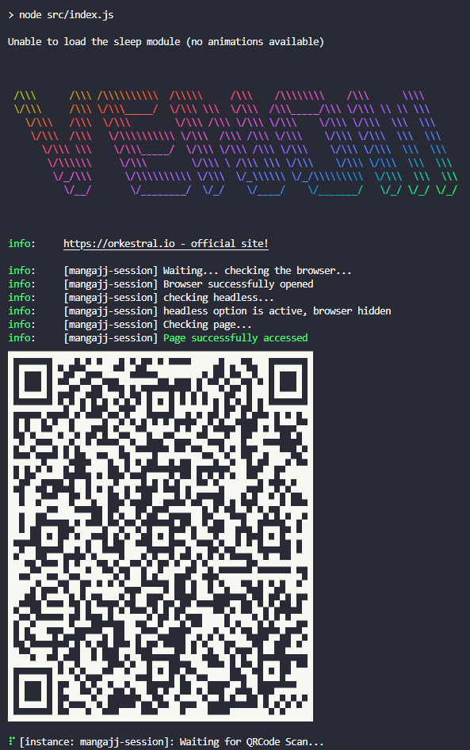
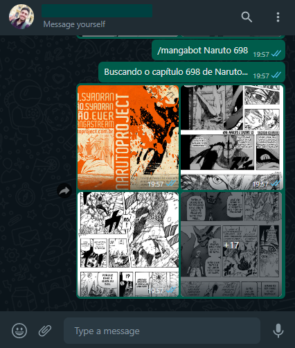
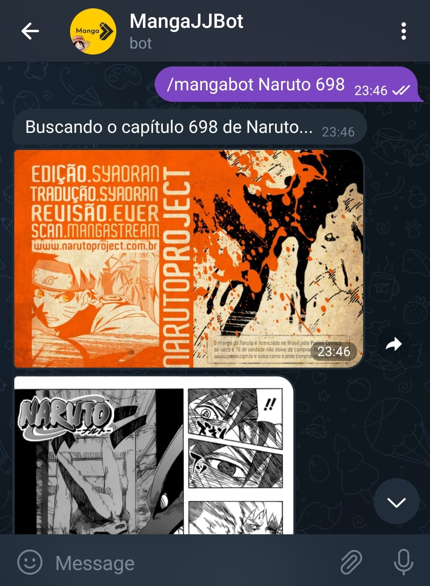
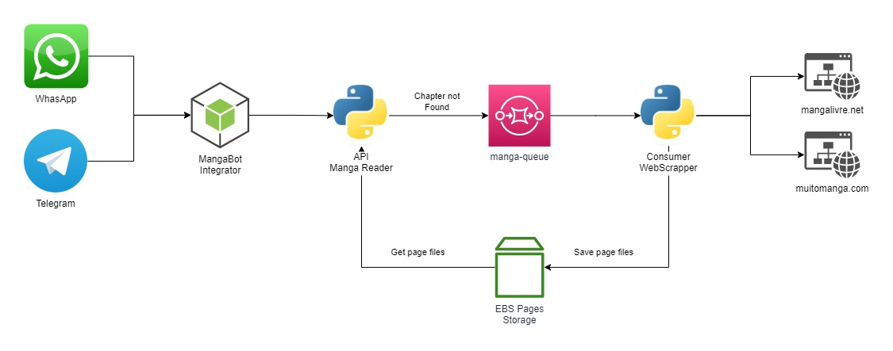

# Manga Reader - Chatbot WhatsApp and Telegram

<p align="center">
   <a href="https://www.linkedin.com/in/darlan-noetzold-9b5bb2180/">
      
   </a>
</p>

This is a simple chatbot for WhatsApp that allows you to read manga from the internet. It was developed using the [Venom Bot](https://github.com/orkestral/venom) library.

## Getting started

1. Install the dependencies

```bash
npm install
```

2. Run the project - Select the platform `whatsapp` or `telegram`

```bash
npm start <platform>
```

3. If whatsapp so scan the QR code with your WhatsApp



4. Send the name and chapter number of the manga you want to read

Example: `/mangabot Naruto 698`

<table>
    <tr>
        <td align="center">
            <h3>WhatsApp</h3>
            
        </td>
        <td align="center">
            <h3>Telegram</h3>
            
            <a href="https://t.me/getmanga">Demo</a>
        </td>
    </tr>
</table>

## Environment Variables

To run this project, you will need to add the following environment variables to your .env file if using the `telegram` platform:

``` .env
TELEGRAM_BOT_TOKEN=
```

## Integrations

This project integrates with the following services:

- [WhatsApp - Venom Bot](https://github.com/orkestral/venom)



## License

[MIT License](LICENSE)

## ⚠ Atention ⚠

This project is for study purposes only, I do not encourage piracy. If you like the manga, buy it. If you want to read it for free, go to the official website. I am not responsible for any misuse of this project.

---
⭐️ From [DarlanNoetzold](https://github.com/DarlanNoetzold)
